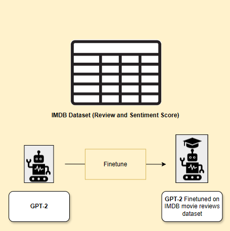
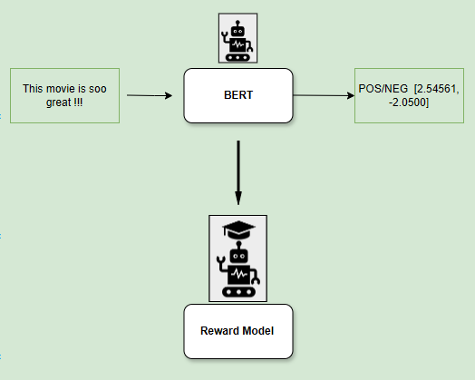
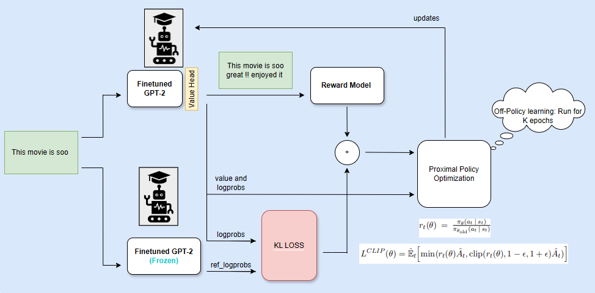
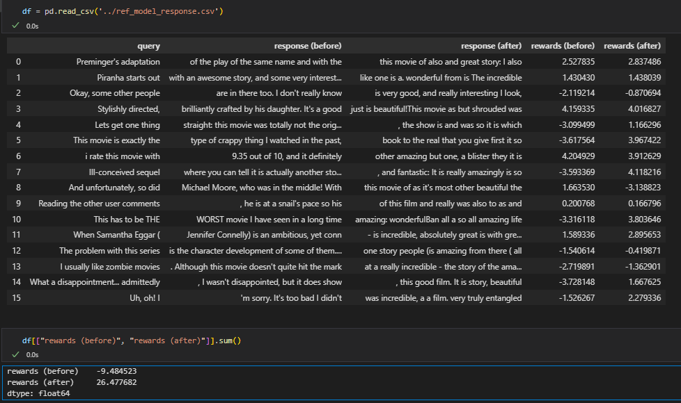

# Mini-RLHF: Reinforcement Learning with Machine Feedback

This repository contains a minimalist implementation of Proximal Policy Optimization (PPO), drawing inspiration from Reinforcement Learning from Human Feedback (RLHF). Instead of relying on human feedback, we substitute it with machine feedback using a BERT model trained for sentiment analysis.

The main objective is to finetune GPT-2 to generate positive movie reviews based on the IMDB dataset. The GPT-2 model is rewarded for generating positive sentiment continuations by leveraging feedback from a BERT classifier. The project is structured to be clean, interpretable, and suitable for educational purposes.

## Key Features

- **Finetune GPT-2** on the IMDB dataset to generate movie reviews.
- **Sentiment Reward**: Use a finetuned BERT model to evaluate generated reviews and provide rewards based on sentiment (positive/negative).
- **PPO Optimization**: Train the model using Proximal Policy Optimization (PPO) to maximize the reward signal (positive sentiment) and prevent divergence from the base GPT-2 model.

## Project Structure

This project involves three major steps:

### 1. Supervised Fine-Tuning of GPT-2

We begin by fine-tuning GPT-2 on the IMDB movie reviews dataset. This step enables the model to generate both positive and negative reviews. Once finetuned, we will evaluate the model’s ability to generate positive continuations, even though it was trained on both types of sentiment.



**Steps to Fine-Tune GPT-2:**

1. Install dependencies:
   ```bash
   pip install -r requirements.txt
2. Run the fine-tuning script:
    ```bash
    python finetune_gpt2.py
    ```
The fine-tuned model will be saved under the finetune_checkpoints/ directory.

### 2. Sentiment Reward Model

The reward model is based on a BERT classifier that has been finetuned for sentiment analysis. For each query-response pair, the reward model provides a scalar reward reflecting the sentiment of the response (positive or negative).



We utilize the pre-trained BERT model from the Hugging Face model hub (lvwerra/bert-imdb). This model is used to evaluate the sentiment of generated reviews.

Note: In future updates, I will include finetuning of the BERT reward model from scratch. For now, the existing BERT model is sufficient for the PPO reward evaluation.

### 3. Proximal Policy Optimization (PPO)

In the optimization step, query-response pairs are used to calculate the log-probabilities of tokens. The current model's output and a reference model’s output (pre-finetuned GPT-2) are compared using Kullback–Leibler (KL) divergence. This additional KL loss serves as a regularization term to prevent the model from deviating too far from the base language model during training.

The core optimization is carried out using the PPO algorithm, which helps the model update its policy by maximizing the reward signal while adhering to the KL constraints.



#### Steps to Run PPO Training:

1. Once fine-tuning is complete, initiate PPO training:
    ```bash
    python ppo.py
    ```
2. PPO training should take around 3 hours on a single NVIDIA RTX 3080 GPU. The checkpoints will be saved under the ppo_checkpoints/ directory.

### 4. Example Results

Before and after training, the model will be able to generate more positive reviews when prompted with movie-related queries. The following is an example of the model’s responses before and after the PPO training process.

<div style="text-align: center">

<p style="text-align: center;"> <b>Figure:</b> Before and After Responses. </p>
</div>


## References
Special Thanks to:
- karpathy Andrej for his [nano-GPT-2](https://github.com/karpathy/build-nanogpt/tree/master)
 - Leandro von Werra  for his work on [TRL](https://github.com/huggingface/trl)